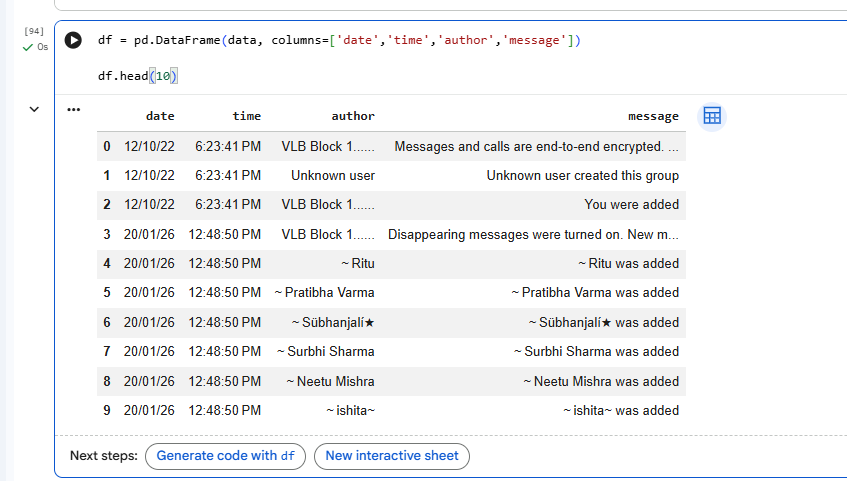
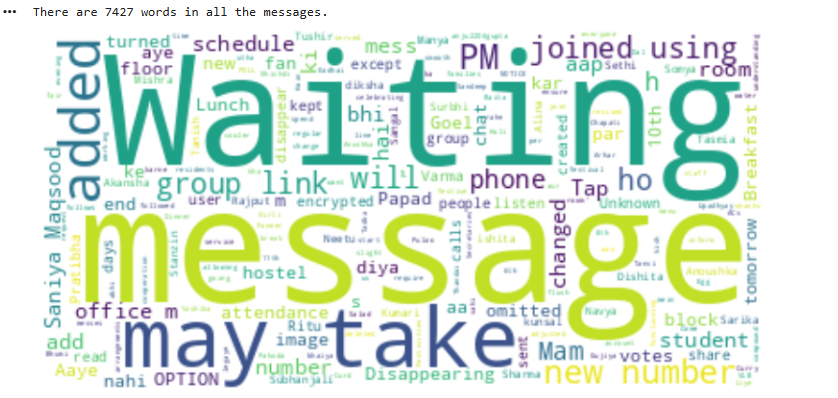
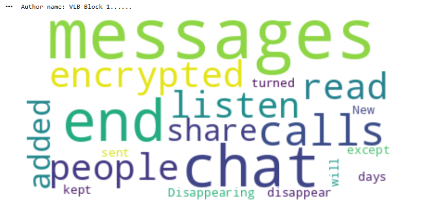
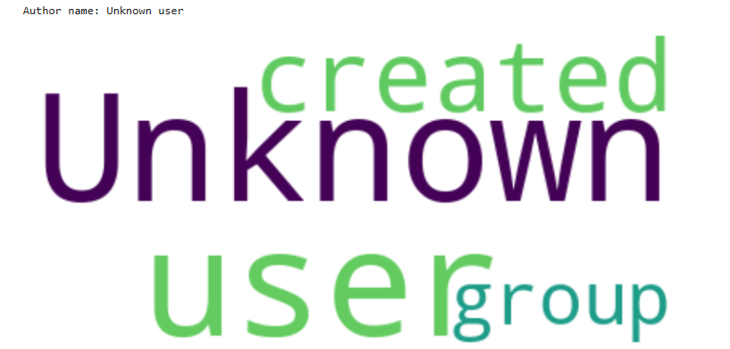
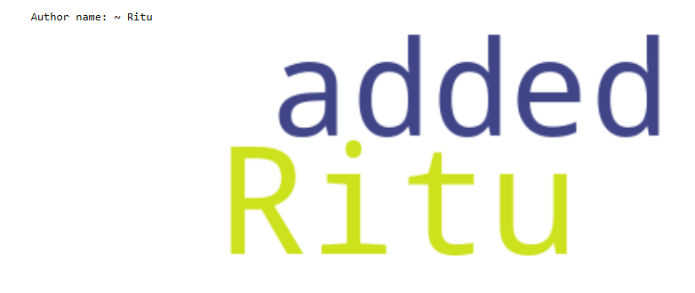
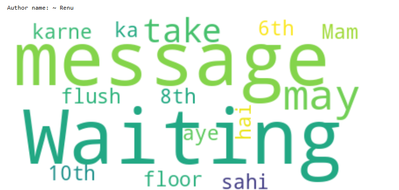
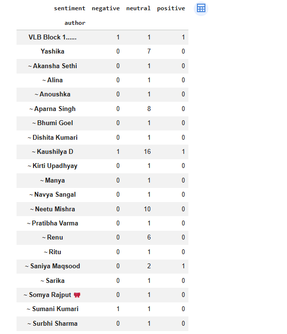

# 💬 WhatsApp Chat Analyzer

A beginner-friendly **Data Science project** that analyzes exported WhatsApp chat data and generates useful insights such as message statistics, word clouds, emoji usage, and sentiment analysis.

This project demonstrates how conversational text data can be processed and visualized using **Python and basic Natural Language Processing (NLP) techniques**.

---

# 🚀 Project Overview

WhatsApp chats contain a large amount of unstructured text data.  
This project processes exported WhatsApp chat files and extracts useful information such as:

- Total messages sent
- Most active users
- Frequently used words
- Emoji usage
- Sentiment of conversations

The analysis is performed using Python libraries like **Pandas, Matplotlib, WordCloud, Regex, Emoji, and VADER Sentiment Analyzer**.

---

# ✨ Features

- 📊 Message statistics
- ☁️ Word cloud visualization
- 👤 User-wise word clouds
- 😊 Sentiment analysis
- 📈 Sentiment visualization
- 👥 Sentiment contribution by users

---

# 📊 Message Statistics

This section provides a summary of chat activity including:

- Total messages
- Media messages
- Emojis used
- Links shared



---

# ☁️ Word Cloud (Overall Chat)

A **word cloud** visualizes the most frequently used words in the chat.  
Larger words indicate higher frequency in the conversation.



---

# 👤 User-wise Word Cloud

Separate word clouds are generated for individual users to analyze their message patterns.

### Word Cloud – User 1



### Word Cloud – User 2



### Word Cloud – User 3



### Word Cloud – User 4



---

# 😊 Sentiment Analysis

Sentiment analysis is performed using **VADER Sentiment Analyzer**, which classifies messages into three categories:

- Positive
- Neutral
- Negative



---

# 📊 Sentiment Distribution

This section shows the number of messages classified into positive, neutral, and negative categories.


---

# 👥 Sentiment by User

This table shows how each user contributes to positive, neutral, and negative messages.


---

# 📅 Sentiment Over Time

This analysis shows how sentiment changes over time based on the date of messages.


---

# 📥 Dataset

The dataset used in this project is a **WhatsApp chat export file**.

---

# 📤 How to Export WhatsApp Chat

1. Open **WhatsApp**
2. Open the chat you want to analyze
3. Click **More Options (⋮)**
4. Select **More → Export Chat**
5. Choose **Without Media**
6. Save the file as `_chat.txt`

---

# ▶️ How to Run the Project

### 1️⃣ Clone the repository

```
git clone https://github.com/yourusername/whatsapp-chat-analyzer.git
```

### 2️⃣ Install dependencies

```
pip install pandas matplotlib wordcloud emoji regex vaderSentiment
```

### 3️⃣ Run the notebook

Open the notebook:

```
chat_analysis.ipynb
```

Upload `_chat.txt` and run the notebook cells.

---

# 🎓 Learning Outcomes

Through this project you will learn:

- Text preprocessing
- Data analysis using Pandas
- Word frequency analysis
- Data visualization
- Sentiment analysis using NLP

---

# 👩‍💻 Author

**Bhargavi Goyal**  
M.Tech CSE – Delhi Technological University  

GitHub  
https://github.com/bhargavi8296  

LinkedIn  
https://linkedin.com/in/bhargavi-bg700  

---

⭐ If you found this project helpful, feel free to **star the repository**.
